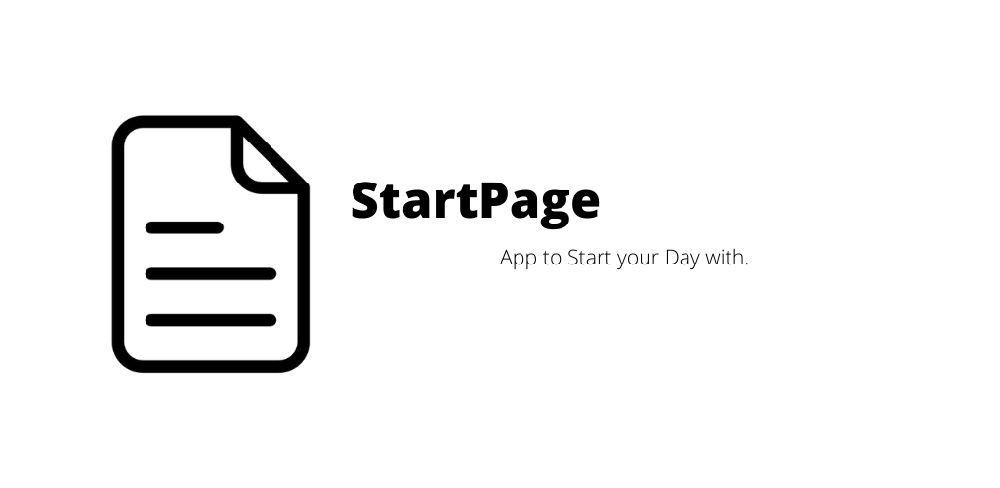
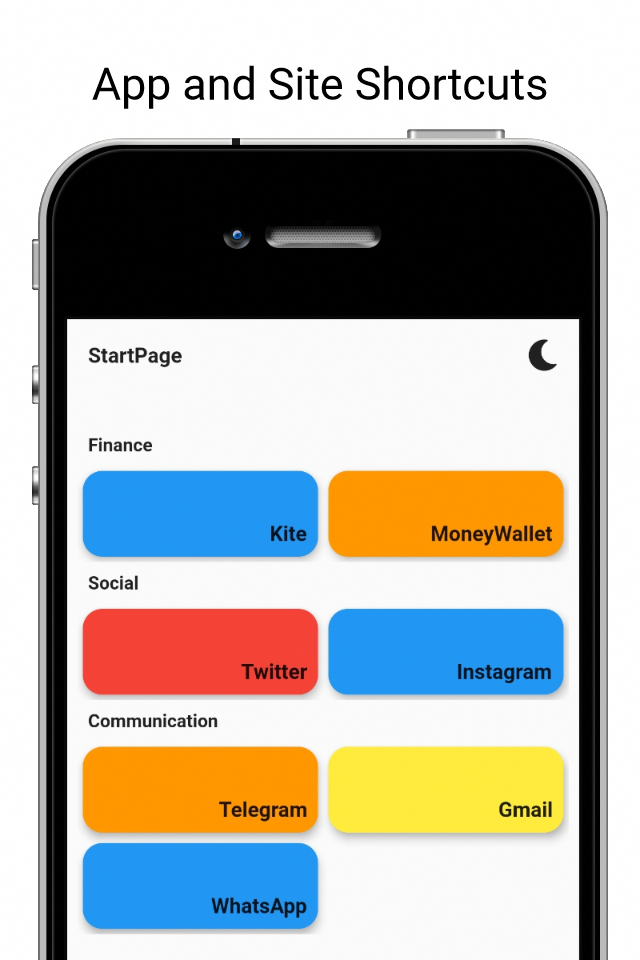
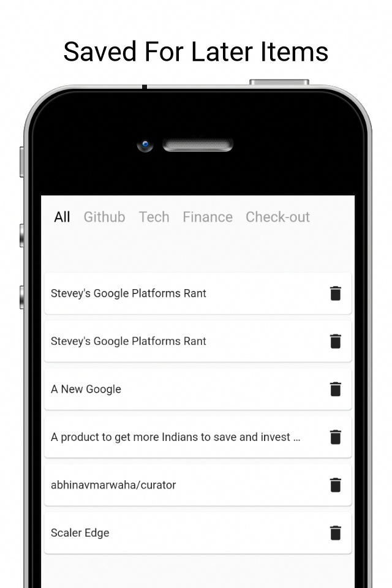
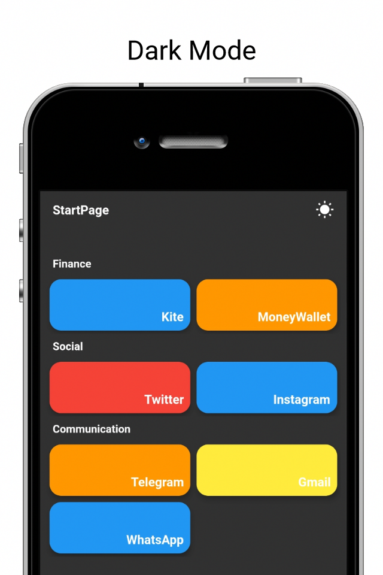

 

StartPage - App to start your day with.

    
    

 

    
    

 
    
    
     

# Features:

* site and app shortcuts
* saved later items with categories
* Dark Mode

# Have Suggetions ?

You can add an issue [here](https://github.com/abhinavmarwaha/StartPage/issues) or fill up a google form [here](https://docs.google.com/forms/d/e/1FAIpQLSdUSutJVweRwC62zUO_WJ8zB3xpvOzAfgnFMh-KUZEXD7Ww-g/viewform?usp=sf_link).

You can contact me at heyabhinav@protonmail.com
